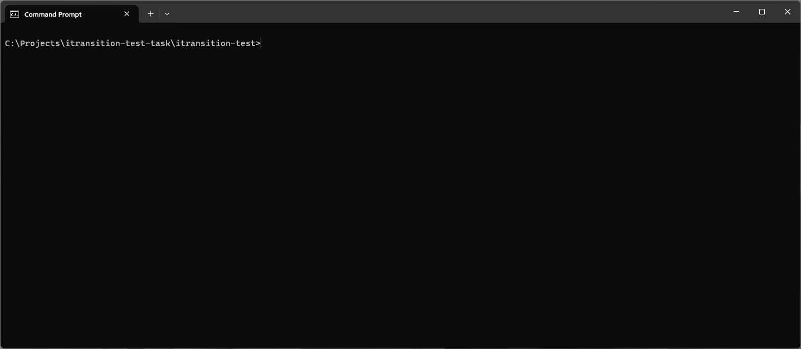
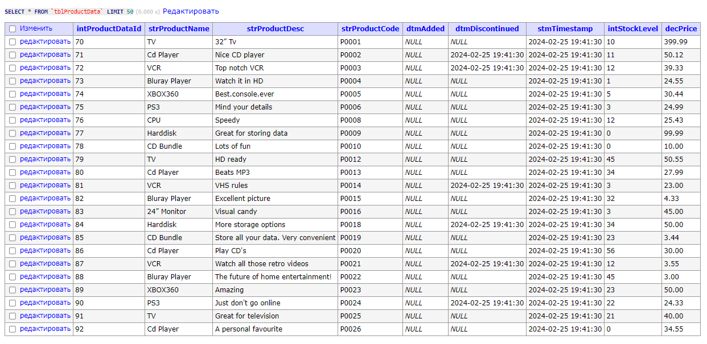

## About

Solution implementation for [Candidate Development Test](./resources/PHP-task.docx)

Description of solution written in [Architectural solutions notes](#architectural-solutions-notes).

## Demo

DB result:

### Architectural solutions notes

- App based on Yii2 with Docker.
- For read CSV file used package [league/csv](https://csv.thephpleague.com/).
- Work with money through [Decimal](https://php-decimal.github.io/) type.
- Work with Logger and Events in use cases through [PSR](https://www.php-fig.org/psr/) interfaces.

According to import business rules:
> - Any stock item which costs less that **$5** and...
> 
> - Any stock items which cost over **$1000** will not be imported.

so need to compare the costs in **USD (dollars)**. But in [stock](./resources/stock.csv) CSV file cost provided in **GBP (Pound sterling)**.

Therefore, before comparing cost that convert to single currency by package [drandin/exchange-rate](drandin/exchange-rate).

- Services layer defined through interfaces. Use cases work with services also through interfaces.
- Used DI for easy make instance and link interfaces with their implementation.
- Used [lint](https://github.com/squizlabs/PHP_CodeSniffer) for code styling.
- Entity, use cases and services are covered with unit tests.

#### Additional Considerations

In Test mentioned certain issues about CSV records:

> 1. Whether the data is correctly formatted for CSV
> 2. Whether the data is correctly formatted for use with a database
> 3. Potential data encoding issues or line termination problems
> 4. Manual interference with the file which may invalidate some entries

Solving these issues:

1. _Not solved in code:_ Treated as an unexpected error and handled by the general handler.
2. _Solved:_ Product entity have validation rules for ensure correct format and possibility to save in DB.
3. _Not solved in code:_ Treated as an unexpected error and handled by the general handler.
4. _Solved:_ Works with records that have been read from CSV file, perform through DTO and have validation.

For solving issue 1 and 3 I would use relevant libraries for validate CSV file format and fix encoding. 

## Requirement
- [git](https://git-scm.com/)
- [Docker](https://www.docker.com/)
- [Docker Compose](https://docs.docker.com/compose/)
- [Make](https://www.gnu.org/software/make/)

## Install

Clone repo:

`git clone -b feature/test-implementation https://github.com/abelapko/itransition-test.git`

Init and run app:

`make init-up`

## User guide

Connect to console of Docker container:

`make cli`

Get command help info:

`yii help product/import`

Run import product:

`yii product/import ./resources/stock.csv`

Run import in Test mode:

`yii product/import ./resources/stock.csv -t=1`

## Configuration

`make init-config`

and edit `.env` file.

## DB manager

You can view DB changes.

Go to:
`http://localhost:8080/?server=db&username=root&db=importTest`

Default password: `example`